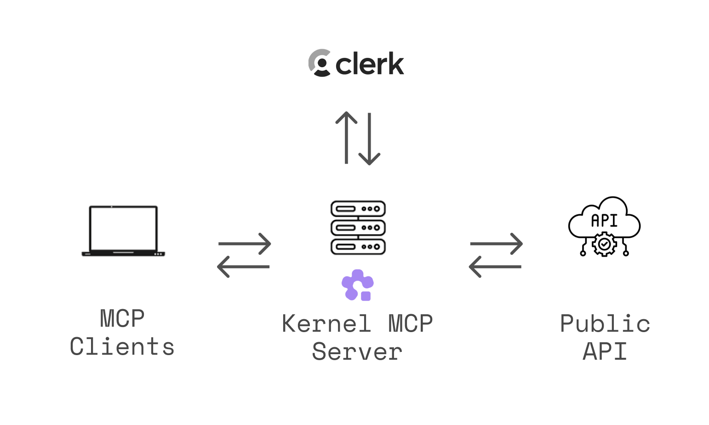

# Kernel MCP Server

[](https://opensource.org/licenses/MIT)
[](https://nodejs.org/)
[](https://nextjs.org/)
[](https://smithery.ai/server/kernel)

A [Model Context Protocol (MCP)](https://modelcontextprotocol.io/) server that provides AI assistants with secure access to [Kernel platform](https://onkernel.com) tools and browser automation capabilities.



🌐 **Use instantly** at `https://mcp.onkernel.com/mcp` — no installation required!

## What is this?

The Kernel MCP Server bridges AI assistants (like Claude, Cursor, or other MCP-compatible tools) with the Kernel platform, enabling them to:

- 🚀 Deploy and manage Kernel apps in the cloud
- 🌐 Launch and control headless Chromium sessions for web automation
- 📊 Monitor deployments and track invocations
- 🔍 Search Kernel documentation and inject context
- 💻 Execute arbitrary Playwright code against live browsers
- 🎥 Automatically record video replays of browser automation

**Open-source & fully-managed** — the complete codebase is available here, and we run the production instance so you don't need to deploy anything.

The server uses OAuth 2.0 authentication via [Clerk](https://clerk.com) to ensure secure access to your Kernel resources.

For a deeper dive into why and how we built this server, see our blog post: [Introducing Kernel MCP Server](https://blog.onkernel.com/p/introducing-kernel-mcp-server).

## Setup Instructions

### General (Transports)

- Streamable HTTP (recommended): `https://mcp.onkernel.com/mcp`
- stdio via `mcp-remote` (for clients without remote MCP support): `npx -y mcp-remote https://mcp.onkernel.com/mcp`

Use the streamable HTTP endpoint where supported for increased reliability. If your client does not support remote MCP, use `mcp-remote` over stdio.

Kernel's server is a centrally hosted, authenticated remote MCP using OAuth 2.1 with dynamic client registration.

## Connect in your client

### Claude

> Our remote MCP server is not compatible with the method Free users of Claude use to add MCP servers.

#### Pro, Max, Team & Enterprise (Claude.ai and Claude Desktop)

1. Go to **Settings → Connectors → Add custom connector**.
2. Enter: **Integration name:** `Kernel`, **Integration URL:** `https://mcp.onkernel.com/mcp`, then click **Add**.
3. In **Settings → Connectors**, click **Connect** next to `Kernel` to launch OAuth and approve.
4. In chat, click **Search and tools** and enable the Kernel tools if needed.

> On Claude for Work (Team/Enterprise), only Primary Owners or Owners can enable custom connectors for the org. After it's configured, each user still needs to go to **Settings → Connectors** and click **Connect** to authorize it for their account.

#### Claude Code CLI

```bash
claude mcp add --transport http kernel https://mcp.onkernel.com/mcp
# Then in the REPL run once to authenticate:
/mcp
```

### Cursor

### Automatic setup

[](https://cursor.com/en/install-mcp?name=Kernel&config=eyJ1cmwiOiAiaHR0cHM6Ly9tY3Aub25rZXJuZWwuY29tL21jcCJ9)

#### Manual setup

1. Press **⌘/Ctrl Shift J**.
2. Go to **MCP & Integrations → New MCP server**.
3. Add this configuration:

```json
{
  "mcpServers": {
    "kernel": {
      "url": "https://mcp.onkernel.com/mcp"
    }
  }
}
```

4. Save. The server will appear in Tools.

### Goose

Click [here](goose://extension?cmd=npx&arg=-y&arg=mcp-remote&arg=https%3A%2F%2Fmcp.onkernel.com%2Fmcp&timeout=300&id=kernel&name=Kernel&description=Access%20Kernel%27s%20cloud-based%20browsers%20via%20MCP) to install Kernel on Goose in one click.

#### Goose Desktop

1. Click `Extensions` in the sidebar of the Goose Desktop.
2. Click `Add custom extension`.
3. On the `Add custom extension` modal, enter:
   - **Extension Name**: `Kernel`
   - **Type**: `STDIO`
   - **Description**: `Access Kernel's cloud-based browsers via MCP`
   - **Command**: `npx -y mcp-remote https://mcp.onkernel.com/mcp`
   - **Timeout**: `300`
4. Click `Save Changes` button.

#### Goose CLI

1. Run the following command:
   ```bash
   goose configure
   ```
2. Select `Add Extension` from the menu.
3. Choose `Command-line Extension`.
4. Follow the prompts:
   - **Extension name**: `Kernel`
   - **Command**: `npx -y mcp-remote https://mcp.onkernel.com/mcp`
   - **Timeout**: `300`
   - **Description**: `Access Kernel's cloud-based browsers via MCP`

### Visual Studio Code

```json
{
  "mcpServers": {
    "kernel": {
      "url": "https://mcp.onkernel.com/mcp",
      "type": "http"
    }
  }
}
```

1. Press **⌘/Ctrl P** → search **MCP: Add Server**.
2. Select **HTTP (HTTP or Server-Sent Events)**.
3. Enter: `https://mcp.onkernel.com/mcp`
4. Name the server **Kernel** → Enter.

### Windsurf

1. Press **⌘/Ctrl ,** to open settings.
2. Navigate **Cascade → MCP servers → View raw config**.
3. Paste:

```json
{
  "mcpServers": {
    "kernel": {
      "command": "npx",
      "args": ["-y", "mcp-remote", "https://mcp.onkernel.com/mcp"]
    }
  }
}
```

4. On **Manage MCPs**, click **Refresh** to load Kernel MCP.

### Zed

1. Press **⌘/Ctrl ,** to open settings.
2. Paste:

```json
{
  "context_servers": {
    "kernel": {
      "source": "custom",
      "command": "npx",
      "args": ["-y", "mcp-remote", "https://mcp.onkernel.com/mcp"]
    }
  }
}
```

### Smithery

You can connect directly to `https://mcp.onkernel.com/mcp`, or use Smithery as a proxy using its provided URL.

- Use Smithery URL in any MCP client:
  1. Open [Smithery: Kernel](https://smithery.ai/server/kernel).
  2. Copy the URL from "Get connection URL".
  3. Paste it into your MCP client's "Add server" flow.

- Use Kernel in Smithery's Playground MCP client:
  1. Open [Smithery Playground](https://smithery.ai/playground).
  2. Click "Add servers", search for "Kernel", and add it.
  3. Sign in and authorize Kernel when prompted.

### Others

Many other MCP-capable tools accept:

- **Command:** `npx`
- **Arguments:** `-y mcp-remote https://mcp.onkernel.com/mcp`

```json
{
  "kernel": {
    "command": "npx",
    "args": ["-y", "mcp-remote", "https://mcp.onkernel.com/mcp"]
  }
}
```

Configure these values wherever the tool expects MCP server settings.

## Tools

### Browser Automation

- `create_browser` - Launch a new browser session with options (headless, stealth, timeout, profile)
- `get_browser` - Get browser session information
- `list_browsers` - List active browser sessions
- `delete_browser` - Terminate a browser session
- `execute_playwright_code` - Execute Playwright/TypeScript code in a fresh browser session with automatic video replay and cleanup

### Profile Management

- `setup_profile` - Create or update browser profiles with guided setup process
- `list_profiles` - List all available browser profiles
- `delete_profile` - Delete browser profile permanently

### App Management

- `list_apps` - List apps in your Kernel organization with optional filtering
- `invoke_action` - Execute actions in Kernel apps
- `get_deployment` - Get deployment status and logs
- `list_deployments` - List all deployments with optional filtering
- `get_invocation` - Get action invocation details

### Documentation & Search

- `search_docs` - Search Kernel platform documentation and guides

## Resources

- `browsers://` - Access browser sessions (list all or get specific session)
- `profiles://` - Access browser profiles (list all or get specific profile)
- `apps://` - Access deployed apps (list all or get specific app)

## Prompts

- `kernel-concepts` - Get explanations of Kernel's core concepts (browsers, apps, overview)

## Troubleshooting

- Cursor clean reset: ⌘/Ctrl Shift P → run `Cursor: Clear All MCP Tokens` (resets all MCP servers and auth; re-enable Kernel and re-authenticate).
- Clear saved auth and retry: `rm -rf ~/.mcp-auth`
- Ensure a recent Node.js version when using `npx mcp-remote`
- If behind strict networks, try stdio via `mcp-remote`, or explicitly set the transport your client supports

## Examples

### Invoke apps from anywhere

```
Human: Run my web-scraper app to get data from reddit.com
Assistant: I'll execute your web-scraper action with reddit.com as the target.
[Uses invoke_action tool to run your deployed app in the cloud]
```

### Execute Playwright code dynamically

```
Human: Go to example.com and get me the page title
Assistant: I'll execute Playwright code to navigate to the site and retrieve the title.
[Uses execute_playwright_code tool with code: "await page.goto('https://example.com'); return await page.title();"]
Returns: { success: true, result: "Example Domain", replay_url: "https://..." }
```

### Set up browser profiles for authentication

```
Human: Set up a profile for my work accounts
Assistant: I'll create a profile and guide you through the setup process.
[Uses setup_profile tool]

Human: I'm done setting up my accounts
Assistant: Perfect! I'll close the browser session and save your profile.
[Uses delete_browser tool to save profile]
```

## 🤝 Contributing

We welcome contributions! Please see our contributing guidelines:

1. **Fork the repository** and create your feature branch
2. **Make your changes** and add tests if applicable
3. **Run the linter and formatter**:
   ```bash
   bun run lint
   bun run format
   ```
4. **Test your changes** thoroughly
5. **Submit a pull request** with a clear description

### Development Guidelines

- Follow the existing code style and formatting
- Add TypeScript types for new functions and components
- Update documentation for any API changes
- Ensure all tests pass before submitting

## 📄 License

This project is licensed under the MIT License - see the [LICENSE](LICENSE) file for details.

## 🔗 Related Projects

- [Model Context Protocol](https://modelcontextprotocol.io/) - The protocol specification
- [Kernel Platform](https://onkernel.com) - The platform this server integrates with
- [Clerk](https://clerk.com) - Authentication provider
- [@onkernel/sdk](https://www.npmjs.com/package/@onkernel/sdk) - Kernel JavaScript SDK

## 💬 Support

- **Issues & Bugs**: [GitHub Issues](https://github.com/onkernel/kernel-mcp-server/issues)
- **MCP Feedback**: [github.com/kernelxyz/mcp-feedback](https://github.com/kernelxyz/mcp-feedback)
- **Documentation**: [Kernel Docs](https://onkernel.com/docs) • [MCP Setup Guide](https://onkernel.com/docs/mcp-server)
- **Community**: [Kernel Discord](https://discord.gg/FBrveQRcud)

---

Built with ❤️ by the [Kernel Team](https://kernel.so)

# Running this server locally

```bash
cp .env .env.local # Values for the .env.local file are in 1Password > DevEnvVars > MCP section
bun install
bun run dev
```

This will start the server on port 3002.
